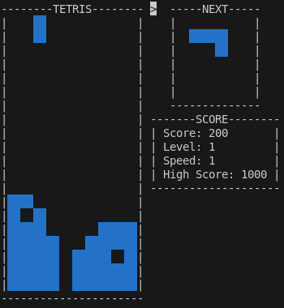
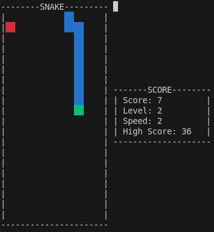
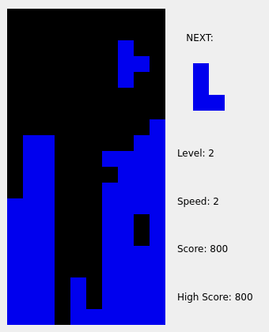
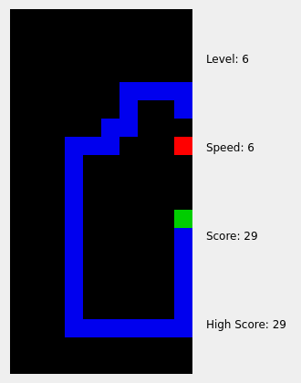
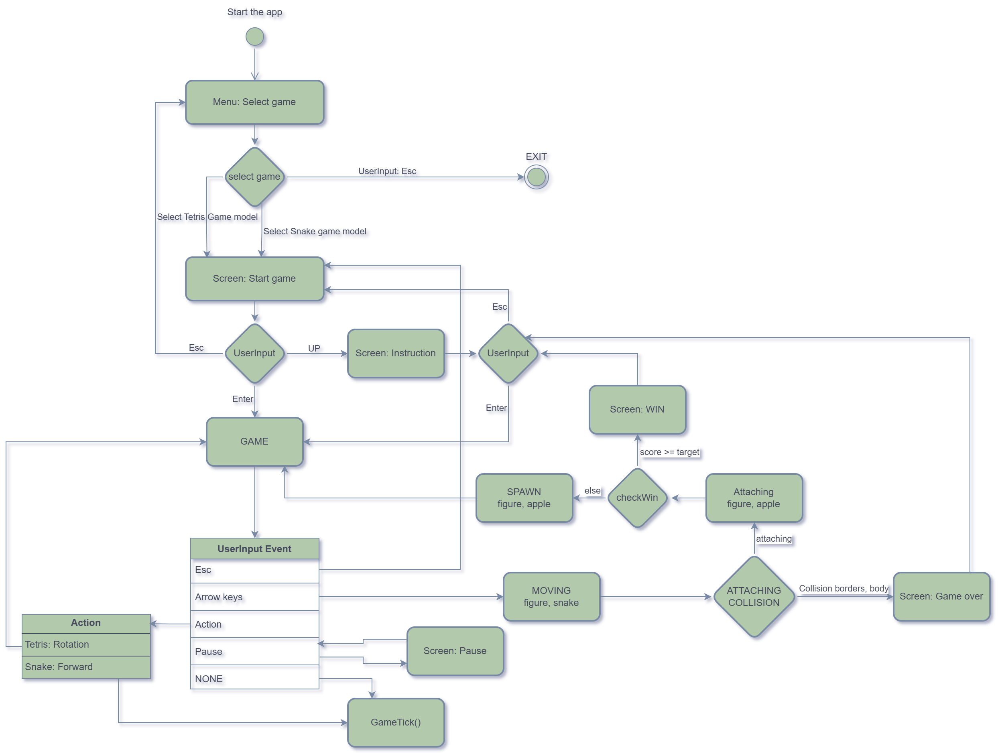

# RetroGames-Cpp

# Retro Games

## О проекте

**RertroGames** - это набор классических игр (Змейка и Тетрис), написанных на языке C++. Проект реализует два варианта интерфейса: консольный и десктопный.

## Особенности

- Игры: Змейка и Тетрис
- Язык: C++
- Интерфейсы: консольный и десктопный
- Сборка и управление проектом через Makefile
- Включены автоматические тесты и проверка качества кода
- Поддержка анализа покрытия кода и утечек памяти
- Docker-окружение для удобного запуска и тестирования

## Требования

- Компилятор C++ (например, g++ с поддержкой C++11 и выше)
- Make
- (Опционально) Docker для запуска в контейнере

## Сборка и запуск

В корне проекта доступен Makefile с несколькими целями:

| Цель          | Описание                                       |
|---------------|------------------------------------------------|
| `all`         | Полная сборка проекта (консольный и десктоп)   |
| `console`     | Сборка консольной версии игр                   |
| `desktop`     | Сборка десктопной версии игр                   |
| `install`     | Установка (копирование бинарников в папку bin) |
| `uninstall`   | Удаление установленных файлов                  |
| `test`        | Запуск автоматических тестов                   |
| `gcov_report` | Генерация отчёта покрытия кода                 |
| `leaks`       | Проверка утечек памяти                         |
| `style`       | Проверка соответствия кода стилю               |
| `clean`       | Очистка сгенерированных файлов                 |
| `docker`      | Сборка и запуск проекта в Docker-контейнере    |
| `dist`        | Создание дистрибутива проекта                  |
| `dvi`         | Генерация документации                         |

### Примеры команд

```sh
# Сборка всех версий
make all

# Сборка консольной версии
make console

# Сборка десктопной версии
make desktop

# Запуск тестов
make test

# Проверка утечек памяти
make leaks

# Очистка проекта
make clean
```

## Запуск игр

После сборки `make install` в папке `bin/` появятся исполняемые файлы:

- `rertro_games_console` - консольная версия игр
- `rertro_games_desktop` - десктопная версия с графическим интерфейсом

Для запуска просто выполните:

```sh
./bin/rertro_games_console

# или
./bin/rertro_games_console
```

## Тестирование и качество кода

- Для запуска тестов используйте `make test`.
- Для анализа покрытия кода - `make gcov_report`.
- Для проверки утечек памяти - `make leaks`.
- Для проверки стиля кода - `make style`.

## Docker

Для удобства запуска и тестирования проекта можно использовать Docker:
- Для запуска консольной версии `make docker`
- Для запуска тестов и отчета по покрытию кода `make docker_gcov`

## Управление в игре

- **Стрелочки** - перемещение персонажа/элементов
- **P** - пауза/возобновление игры
- **ESC** - выход из игры
- **Пробел** - действие (например, поворот блока в Тетрисе или другое действие в Змейке)
- **ENTER** - старт игры

## Архитектура

Проект реализован с использованием паттерна проектирования **MVC (Model-View-Controller)**, что обеспечивает четкое разделение:

- **Model** - логика игры и данные (состояние игрового поля, правила)
- **View** - отображение интерфейса (консольный или десктопный)
- **Controller** - обработка ввода пользователя и управление потоком игры

Такой подход облегчает сопровождение и расширение проекта.

## Реализация консольной версии

Консольная версия игр написана без привлечения сторонних графических библиотек (например, `ncurses`). Для обеспечения одновременного приема пользовательского ввода и обновления игрового экрана используется два потока:

- Один поток отвечает за обработку ввода с клавиатуры.
- Второй поток обновляет вывод в консоли.

Это позволяет добиться плавного и отзывчивого игрового процесса, несмотря на ограничения консольного интерфейса.

[](./misc/tetris_console.gif)

[](./misc/snake_console.gif)

## Реализация десктопной версии

Десктопная версия игр реализована с использованием библиотеки **Qt**, которая предоставляет удобные средства для создания графического интерфейса и обработки событий. Это позволяет сделать интерфейс более современным и отзывчивым по сравнению с консольной версией.

[](./misc/tetris_desktop.gif)

[](./misc/snake_desktop.gif)

## Структура проекта

```txt
├── controller
│   ├── common.cpp
│   ├── common.hpp
│   ├── gameController.cpp
│   └── gameController.hpp
├── Dockerfile
├── Doxyfile
├── gui
│   ├── console
│   │   ├── consoleView.cpp
│   │   └── consoleView.hpp
│   ├── desktop
│   │   ├── desktopView.cpp
│   │   ├── desktopView.hpp
│   │   ├── gameField.hpp
│   │   ├── gameSelector.hpp
│   │   ├── gameWindow.cpp
│   │   ├── gameWindow.hpp
│   │   └── statsWidget.hpp
│   └── gameView.hpp
├── Makefile
├── README.md
├── retro_games
│   ├── gameLogic.hpp
│   ├── snake
│   │   ├── snakeLogic.cpp
│   │   └── snakeLogic.hpp
│   └── tetris
│       ├── tetrisLogic.cpp
│       └── tetrisLogic.hpp
└── test
    ├── testController.cpp
    ├── testController.hpp
    ├── testSnake.cpp
    ├── testSnake.hpp
    ├── testTetris.cpp
    └── testTetris.hpp
```

### Основные каталоги и их назначение

#### 1. `controller/`

Содержит исходные файлы, отвечающие за **логику управления игрой** (Controller в паттерне MVC):

- `common.cpp`, `common.hpp` - общие утилиты и вспомогательные функции.
- `gameController.cpp`, `gameController.hpp` - основной контроллер, управляющий состояниями игры и взаимодействием между моделью и представлением.

---

#### 2. `retro_games/`

Реализация **логики игр** (Model):

- `gameLogic.hpp` - общий интерфейс и определения для игровой логики.
- `snake/` - реализация логики игры "Змейка" (`snakeLogic.cpp`, `snakeLogic.hpp`).
- `tetris/` - реализация логики игры "Тетрис" (`tetrisLogic.cpp`, `tetrisLogic.hpp`).

---

#### 3. `gui/`

Код, отвечающий за **отображение и взаимодействие с пользователем** (View):

- `console/` - консольный интерфейс (`consoleView.cpp`, `consoleView.hpp`).
- `desktop/` - десктопный графический интерфейс на базе Qt, включая различные компоненты GUI (`desktopView.cpp/hpp`, `gameWindow.cpp/hpp`, `gameField.hpp` и др.).
- `gameView.hpp` - общий заголовок для интерфейсов.

---

#### 4. `test/`

Набор **тестов** для проверки различных модулей проекта:

- Тесты контроллера (`testController.cpp`, `testController.hpp`).
- Тесты игры "Змейка" (`testSnake.cpp`, `testSnake.hpp`).
- Тесты игры "Тетрис" (`testTetris.cpp`, `testTetris.hpp`).

---

#### 5. Прочие файлы и каталоги

- `Dockerfile` - описание сборки Docker-образа для проекта.
- `Doxyfile` - конфигурация для генерации документации с помощью Doxygen.
- `Makefile` - скрипт сборки и управления проектом.
- `misc/` - дополнительные материалы: схемы, анимации и скриншоты.
- `README.md` - документация проекта.

---

Ниже представлена схема конечного автомата состояний (FSM) для управления логикой игры:

[](./misc/retro_games.png)
